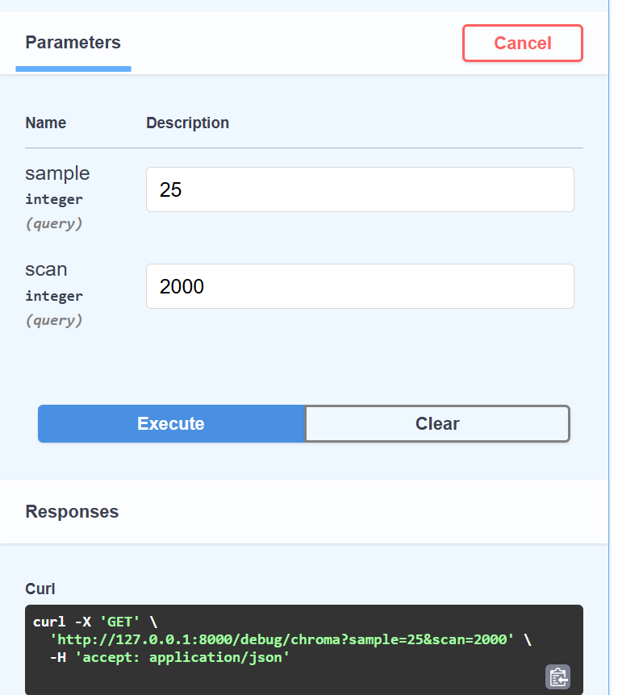
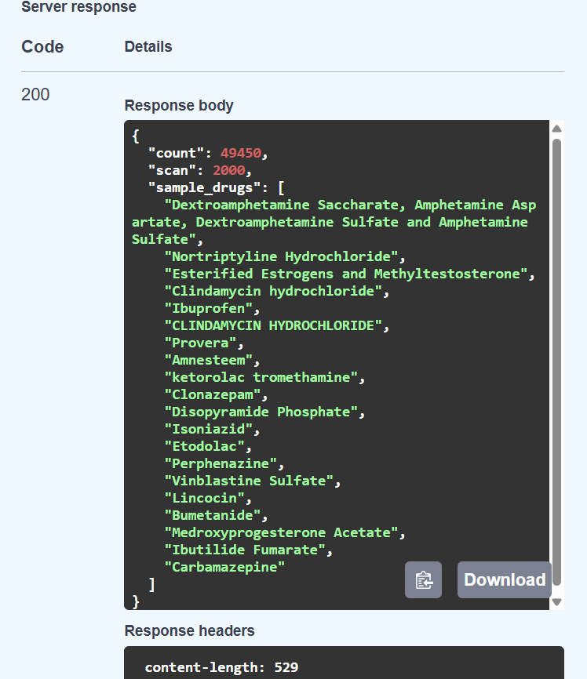
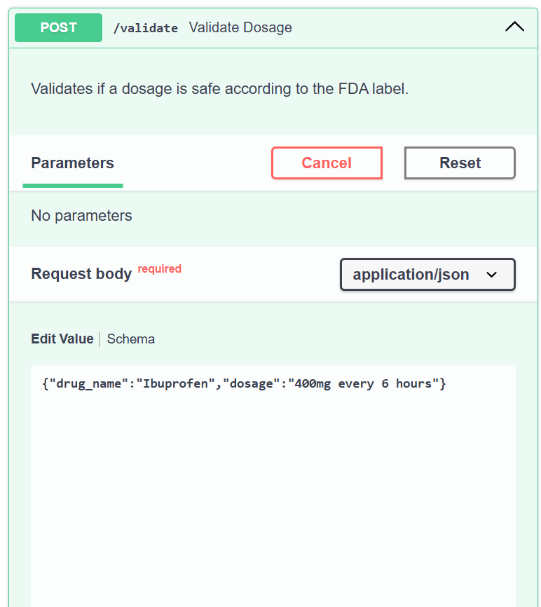
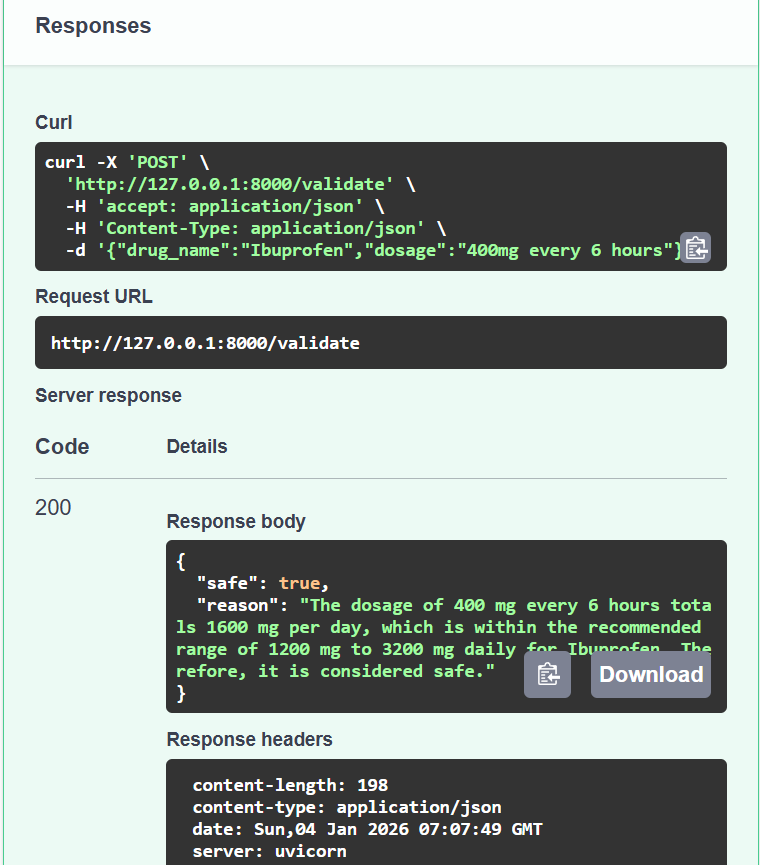
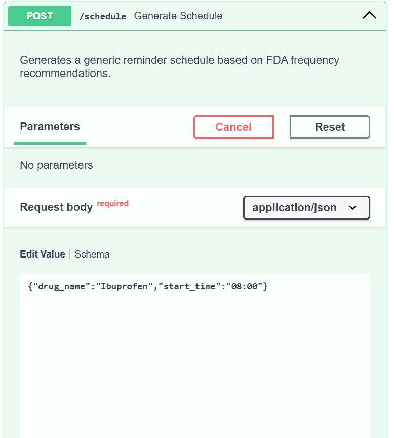
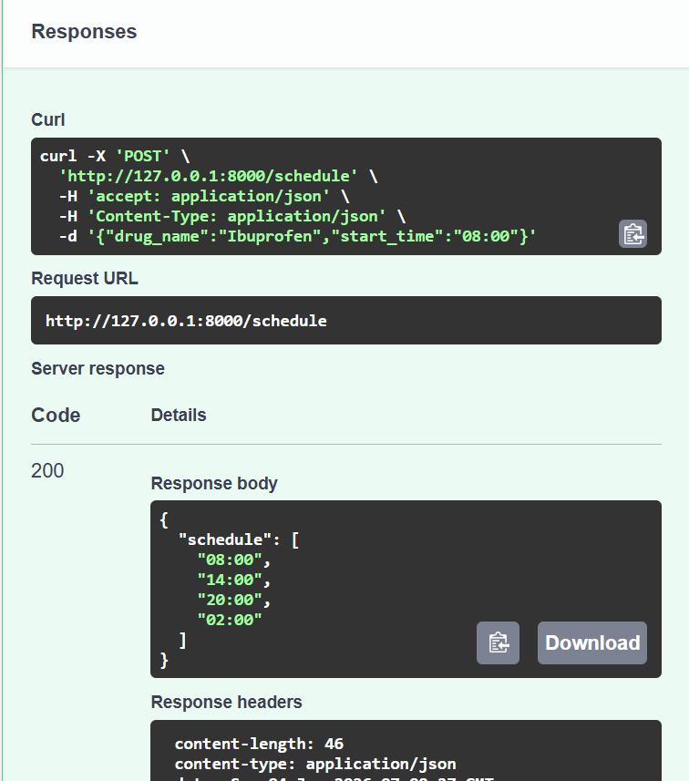

# MedGuard: FDA-Label-Grounded Medication Safety Assistant

## Problem Statement

Medication errors are a leading cause of preventable harm in healthcare. Patients frequently misunderstand drug labels, take incorrect doses, ignore food-related instructions, or rely on unreliable online sources. Traditional AI chatbots are unsafe in this domain because they may hallucinate or provide unverified medical advice.

MedGuard solves this by using **Retrieval-Augmented Generation (RAG)** over **official FDA drug labels**. Every response is grounded in regulatory-grade documentation, ensuring that users receive accurate, traceable, and safe medication information.

## Current Status

✅ **Working MVP** - Core RAG backend is working end-to-end (FastAPI + LangChain + ChromaDB). All API endpoints (`/ask`, `/validate`, `/schedule`) are returning the expected JSON responses, and ingestion/chunking has been tuned to improve FDA-label coverage and answer quality.

## Getting Started

For detailed setup instructions, please refer to [SETUP.md](SETUP.md).

### Quickstart (Windows + Conda)

The full openFDA label dataset is large. For a demo/hackathon, ingest a small subset (4–5 partitions) and cap the total chunks so setup finishes quickly while still proving the end-to-end RAG flow.

## System Architecture

MedGuard follows a safety-first Retrieval-Augmented Generation (RAG) pipeline:

1. The user submits a medication-related question along with optional patient context (age, pregnancy, etc.).

2. The system retrieves relevant sections (Dosage, Warnings, Contraindications, ADRs) from FDA drug labels stored in ChromaDB.

3. A Safety & Conflict Analyzer checks for contradictions or risk factors.

4. The retrieved FDA text is passed to the LLM via LangChain.

5. The LLM generates a grounded answer and a structured reminder plan.

6. The system returns a JSON response with citations and confidence.

This architecture ensures that every output is verifiable, explainable, and compliant with medical safety requirements.

## Technology Stack

| Layer        | Technology |
|--------------|------------|
| Language     | Python |
| LLM          | OpenAI GPT / Google Gemini |
| Framework    | LangChain |
| Vector Store | ChromaDB |
| API Layer    | FastAPI |
| Data Source  | openFDA Drug Label Dataset |
| Validation   | Pydantic |

## System Flow

1. The user submits a medication-related question.

2. The system enriches the query with basic patient context (age, pregnancy, etc.).

3. Relevant sections from FDA drug labels are retrieved from the vector database.

4. Safety and conflict checks are applied to validate dosage and warnings.

5. The LLM generates a grounded response using only the retrieved FDA data.

6. A structured medication reminder plan is created from the dosage instructions.

7. The final answer is returned as a JSON response with citations and confidence.

## Future Innovations

- **Adherence + escalation workflow**: reminders + missed-dose logic (label-only) and an optional escalation workflow (email/SMS) when high-risk keywords appear.
- **Dose Safety Engine (label-first)**: parse dose limits, frequency, max daily dose, food/alcohol rules from labels and return a structured “safe/unsafe + why” verdict with citations.
- **Multilingual label-grounded mode**: translate retrieved FDA text first, then answer in the user’s language while keeping citations to the original English sections.

## Screenshots

### System architecture (RAG + safety-first pipeline)

### Optional workflow automation (n8n)

### FastAPI docs (endpoints)

Swagger UI showing the available endpoints: `/ask`, `/validate`, `/schedule`.

### FastAPI docs (schemas)

Request/response schemas used by the API.

### Testing phase (Swagger UI)
#### Debug: `/debug/chroma`

#### Chat: `/ask`

#### Dosage validation: `/validate`

#### Schedule generator: `/schedule`

